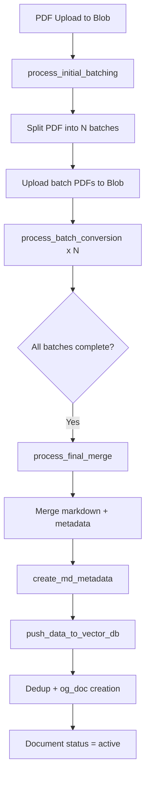
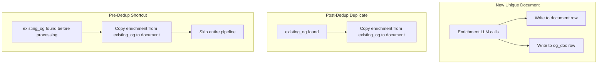
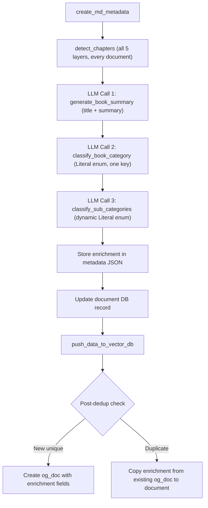

# Book Enrichment Pipeline: Chapters, Summary, Title, and Categorization

## Current Pipeline Recap

The worker pipeline in [worker.py](worker.py) follows this flow:



The enrichment steps will be injected **after** `create_md_metadata` returns and **before** the vector push, inside `process_final_merge` (~line 373-385 of [worker.py](worker.py)).

---

## 1. Chapter Detection Strategy

### Current State

[worker/metadataHelper.py](worker/metadataHelper.py) already has chapter detection logic:

- `create_md_metadata()` (line 294) parses all markdown headings into `all_headings` dict
- It then matches `table_of_contents` entries from marker's `_meta.json` against `all_headings`
- Matched headings become `chapters` with `pageNumber`, `contentIndex`, `level`, `word_count`

### Problem

This approach **only works when marker-pdf produces a valid `table_of_contents`** in its `_meta.json`. Many PDFs (especially scanned or poorly structured ones) produce an empty or inaccurate TOC.

### Proposed Strategy: Multi-layer Chapter Detection (runs for ALL documents)

Chapter detection is **not selective** -- every document goes through all applicable layers in order. Each layer enriches or fills in what the previous one could not.

**Layer 1 -- Marker TOC matching (existing logic, kept as-is):**

- Match `table_of_contents` entries from marker's `_meta.json` against `all_headings`
- Produces initial `chapters` dict

**Layer 2 -- Heading-level analysis (always runs to supplement Layer 1):**

- Collect all headings from `metadata["contents"]` where `type == "heading"`
- If Layer 1 found chapters, merge any H1/H2 headings that were missed by the TOC match
- If Layer 1 found nothing, assign chapter boundaries at `level == 1` headings (H1). If no H1 exists, fall back to `level == 2` (H2)
- Build the same `chapters` dict structure: `{title: {pageNumber, contentIndex, level, word_count}}`
- Reuse `find_chapter_word_counts()` to compute per-chapter word counts

**Layer 3 -- Regex pattern matching (always runs to catch unlabeled chapters):**

- Scan all content items for chapter-like patterns regardless of whether they are headings:

```python
CHAPTER_PATTERNS = [
    r"^#{1,3}\s*chapter\s+\w+",
    r"^#{1,3}\s*part\s+\w+",
    r"^chapter\s+\d+",
    r"^CHAPTER\s+[IVXLCDM]+",
]
```

- Any matched content items not already in `chapters` are added

**Layer 4 -- LLM-assisted refinement (always runs):**

- Send the first ~3000 words + all extracted headings + any chapters found so far to `gpt-4.1-mini`
- The LLM validates existing chapters and identifies any additional chapter-level boundaries the heuristics missed
- Returns a structured list of chapter titles mapped to their content indices

**Layer 5 -- Page 1 guarantee (always runs as final step):**

After all detection layers complete, enforce a strict invariant: **page 1 must always belong to a chapter**. Check if any chapter has `contentIndex == 1` or `pageNumber == 1`. If not, insert a default chapter at the very beginning:

```python
DEFAULT_FIRST_CHAPTER = {
    "pageNumber": 1,
    "contentIndex": 1,
    "level": 0,
    "word_count": 0   # recomputed by find_chapter_word_counts()
}
```

- The default chapter key is `"Beginning"` (or derived from the book title if available)
- Its `word_count` spans from `contentIndex 1` up to (but not including) the next actual chapter's `contentIndex`
- This ensures no content is orphaned before the first real chapter -- critical for TTS playback and the infinite-scroll modern view where every content block must belong to a chapter

### Implementation Location

- Add a new function `detect_chapters()` in [worker/metadataHelper.py](worker/metadataHelper.py)
- Call it from `create_md_metadata()` after the existing TOC matching block (line 308-318)
- The existing `chapters` dict structure is preserved; this just improves the detection fallback
- The page-1 guarantee runs as the very last step inside `detect_chapters()`, after all layers have contributed

### Data Storage

No schema change needed -- chapters are already stored in the metadata JSON blob at `markdowns/{id}/{id}.json` under the `chapters` key.

---

## 2. Book Summary and Title Generation

### Approach

Use `gpt-4.1-mini` (already in [requirements-worker.txt](requirements-worker.txt) via `openai>=1.0.0`) with structured output to generate:

- **`summary`**: 2-4 sentence description of the book's content and themes
- **`generated_title`**: A clean title inferred from the content (useful when `display_name` is a filename like `doc_abc123.pdf`)

### Input Construction

Build a representative sample from `metadata["contents"]` to stay under ~4000 tokens:

1. **First ~1500 words** of content (covers title page, preface, introduction)
2. **Chapter titles** from the `chapters` dict (full list)
3. **A ~500-word sample from the middle** of the book
4. **Last ~500 words** (covers conclusion/afterword)

This gives the LLM a broad view without sending the entire book.

### Prompt Design

```python
class BookSummaryResponse(BaseModel):
    title: str = Field(..., description="The inferred title of the book")
    summary: str = Field(..., description="2-4 sentence summary of the book")
```

The system prompt will instruct the model to:

- Extract the actual title from content (not invent one)
- Write a factual summary suitable for a library catalog entry
- Handle edge cases (single-chapter docs, research papers, manuals)

### Implementation

- New file: `worker/enrichmentHelper.py` containing `generate_book_summary(metadata: dict) -> dict`
- Uses `client.beta.chat.completions.parse(response_format=BookSummaryResponse)` for structured output
- Returns `{"title": "...", "summary": "..."}`
- Called from `process_final_merge()` in [worker.py](worker.py) after `create_md_metadata()` returns

### Data Storage

**`summary` is NOT stored on the `documents` table** -- documents are fetched frequently (home page, book list, shared books) and carrying a long summary text on every read would bloat the response payload. Instead:

- **`generated_title`** -- stored on **both** `documents` and `original_documents` (short string, useful in list views)
- **`summary`** -- stored **only** on `original_documents` and in the metadata JSON blob. Fetched on-demand via a join or separate query when the user opens a specific book's detail view.

New nullable columns:

| Table | Column | Type | Notes |
|-------|--------|------|-------|
| `documents` | `generated_title` | `String` | Fast reads, shown in list views |
| `original_documents` | `generated_title` | `String` | Source of truth, propagated to `documents` on dedup |
| `original_documents` | `summary` | `String` | Only fetched on-demand (book detail view) |

Update in:

- [documents/data/document/model.py](documents/data/document/model.py) -- Add `generated_title` only
- [documents/data/original_document/model.py](documents/data/original_document/model.py) -- Add `generated_title` + `summary`
- [documents/data/schema.py](documents/data/schema.py) -- Add `generated_title` to `Document` schema; create a separate `DocumentDetail` or summary endpoint schema that includes `summary`
- Also store `summary` in metadata JSON for offline/client-side access

---

## 3. Book Categorization (Two LLM Calls with Literal-Constrained Structured Output)

Categorization uses **`Literal` type constraints** in Pydantic models passed through OpenAI's structured output (`client.beta.chat.completions.parse()`). This leverages OpenAI's **constrained decoding** -- the model **cannot** produce a value outside the `Literal` enum at the token generation level. No post-hoc validation is needed.

The codebase already uses this pattern in [ai_engine/graph/askGraph.py](ai_engine/graph/askGraph.py) with `llm.with_structured_output(Model, method="json_schema")`. For the worker, we use OpenAI's native `client.beta.chat.completions.parse()` which provides the same JSON schema constraint (avoiding adding LangChain dependencies to the worker).

### Call 1: Category Classification (Static `Literal` Enum)

The category field uses a **static `Literal`** containing all 10 category keys. The `Literal` constraint makes it structurally impossible to return an invalid category -- the API rejects any token sequence that would produce a value outside the enum.

```python
from typing import Literal
from pydantic import BaseModel, Field

CategoryKey = Literal[
    "technical_engineering",
    "science_math",
    "business_economics",
    "education_textbooks",
    "research_papers",
    "fiction_literature",
    "history_society",
    "law_policy",
    "manuals_documentation",
    "self_help_psychology",
]

class CategoryResponse(BaseModel):
    category: CategoryKey = Field(
        ...,
        description="The single best-matching category for this book."
    )
```

The system prompt describes each category so the model can make an informed choice:

```
Classify this book into exactly one category:

- technical_engineering: Computer science, software engineering, AI, data science,
  cybersecurity, networking, electronics, mechanical/civil engineering, robotics, DevOps
- science_math: Physics, chemistry, biology, mathematics, statistics, astronomy,
  earth science, environmental science, biotechnology
- business_economics: Economics, finance, accounting, marketing, management,
  entrepreneurship, business strategy, operations, startup guides
- education_textbooks: School/university textbooks, exam preparation, study guides,
  reference books, curriculum material
- research_papers: Journal articles, conference papers, thesis/dissertations,
  white papers, technical reports, survey papers
- fiction_literature: Novels, short stories, fantasy, science fiction, mystery/thriller,
  historical fiction, romance, drama, poetry, literary fiction
- history_society: World history, political science, sociology, anthropology,
  cultural studies, geography, biographies, autobiographies
- law_policy: Legal textbooks, case law, contracts, government policy, regulations,
  compliance documents, international law
- manuals_documentation: Software documentation, product manuals, user guides,
  installation guides, API documentation, technical manuals, how-to guides
- self_help_psychology: Self-improvement, productivity, psychology, mental health,
  career guides, leadership, motivation, mindfulness
```

Usage:

```python
response = client.beta.chat.completions.parse(
    model="gpt-4.1-mini",
    messages=[
        {"role": "system", "content": CATEGORY_SYSTEM_PROMPT},
        {"role": "user", "content": book_sample_text},
    ],
    response_format=CategoryResponse,
)
category = response.choices[0].message.parsed.category  # guaranteed to be a valid key
```

**No validation needed** -- the `Literal` type in the JSON schema enforces the constraint at the API level via constrained decoding.

### Call 2: Subcategory Classification (Dynamically Built `Literal` Enum)

Once the category is resolved, we build a **dynamic Pydantic model** at runtime where the `Literal` contains only the subcategories of that specific category. This is done using `pydantic.create_model()`.

```python
from pydantic import create_model, Field

def build_subcategory_model(category: str) -> type[BaseModel]:
    """Build a Pydantic model with a Literal enum scoped to the resolved category."""
    valid_subs = tuple(BOOK_CATEGORIES[category])
    SubCatLiteral = Literal[valid_subs]  # type: ignore

    return create_model(
        "SubCategoryResponse",
        sub_categories=(list[SubCatLiteral], Field(
            ...,
            description=f"1-3 most relevant subcategories for this book within '{category}'."
        )),
    )
```

The system prompt for this call describes each subcategory within the resolved category:

```python
def build_subcategory_prompt(category: str) -> str:
    descriptions = SUBCATEGORY_DESCRIPTIONS[category]  # dict of sub_key -> description
    lines = [f"Pick 1-3 subcategories from '{category}':"]
    for sub_key, desc in descriptions.items():
        lines.append(f"- {sub_key}: {desc}")
    return "\n".join(lines)
```

Usage:

```python
SubCategoryModel = build_subcategory_model(category)

response = client.beta.chat.completions.parse(
    model="gpt-4.1-mini",
    messages=[
        {"role": "system", "content": build_subcategory_prompt(category)},
        {"role": "user", "content": book_sample_text},
    ],
    response_format=SubCategoryModel,
)
sub_categories = response.choices[0].message.parsed.sub_categories  # guaranteed valid
```

The model can **only** output values from the resolved category's subcategory list. Cross-category leakage is structurally impossible because the JSON schema enum sent to the API contains only that category's subcategories.

### Why This Approach

- **Zero validation code** -- the constraint is enforced by OpenAI's constrained decoding at the token generation level, not by post-hoc Python validation
- **Consistent with codebase** -- same structured output pattern used in `askGraph.py` with `with_structured_output(method="json_schema")`
- **Two calls remain necessary** -- the second call's `Literal` is dynamic (depends on the first call's result), so they cannot be merged into a single call
- **Each call is ~1s** with `gpt-4.1-mini`, adding negligible latency

### Data Storage

`category` and `sub_categories` are short values useful for filtering and display in list views, so they are stored on **both** tables:

| Table | Column | Type | Notes |
|-------|--------|------|-------|
| `documents` | `category` | `String` | Fast reads, filtering in list views |
| `documents` | `sub_categories` | `ARRAY(String)` | Fast reads, filtering in list views |
| `original_documents` | `category` | `String` | Source of truth, propagated on dedup |
| `original_documents` | `sub_categories` | `ARRAY(String)` | Source of truth, propagated on dedup |

Update in:

- [documents/data/document/model.py](documents/data/document/model.py)
- [documents/data/original_document/model.py](documents/data/original_document/model.py)
- [documents/data/schema.py](documents/data/schema.py)

---

## 4. Enrichment Storage and Dedup Propagation

Enrichment data (`generated_title`, `summary`, `category`, `sub_categories`) is a property of the **content** -- the underlying PDF -- not the user's document copy. The `original_documents` table is the canonical owner of this data.

### Schema Changes

**`original_documents` table** -- add 4 nullable columns:

```python
class OriginalDocument(Base):
    __tablename__ = "original_documents"

    # ... existing columns ...
    generated_title = Column(String, nullable=True)
    summary = Column(String, nullable=True)       # summary lives HERE only
    category = Column(String, nullable=True)
    sub_categories = Column(ARRAY(String), nullable=True)
```

**`documents` table** -- add 3 nullable columns (NO `summary` -- it would bloat frequent reads):

```python
class Document(Base):
    __tablename__ = "documents"

    # ... existing columns ...
    generated_title = Column(String, nullable=True)
    # summary is NOT here -- fetched on-demand from original_documents or metadata JSON
    category = Column(String, nullable=True)
    sub_categories = Column(ARRAY(String), nullable=True)
```

### Write Path: `process_final_merge` (new unique document)

When a new unique document completes processing (post-dedup creates `og_doc`), enrichment is written to both rows -- but `summary` only goes to `og_doc`:

```python
# --- Inside process_final_merge, after enrichment is computed ---

# Write enrichment to document row (no summary)
document.generated_title = enrichment_title
document.category = category
document.sub_categories = sub_categories

# --- Later, in the post-dedup "new unique document" branch (line 428-448) ---
og_doc = OriginalDocument(
    original_document_id=og_doc_id,
    file_hash=file_hash,
    size_in_kilobytes=document.size_in_kilobyes,
    images=image_filenames,
    generated_title=enrichment_title,      # NEW
    summary=enrichment_summary,            # NEW (only on og_doc)
    category=category,                     # NEW
    sub_categories=sub_categories,         # NEW
)
og_repo.create(og_doc)
```

### Write Path: Post-dedup duplicate (another concurrent upload of same file)

When a post-dedup check finds an existing `og_doc` (line 418-427), the duplicate document copies enrichment (except `summary`) from `existing_og`:

```python
# --- Inside process_final_merge, post-dedup "duplicate" branch (line 418-427) ---
if existing_og:
    document.original_document_id = existing_og.original_document_id
    document.images = existing_og.images
    document.generated_title = existing_og.generated_title      # NEW
    document.category = existing_og.category                    # NEW
    document.sub_categories = existing_og.sub_categories        # NEW
    # summary NOT copied -- lives only on og_doc, fetched on-demand
    cached_doc_repo.update_document(document)
    # ... delete vectors and blobs ...
```

### Read Path: Pre-dedup shortcut (`process_initial_batching`)

When a duplicate PDF is detected **before** processing even starts (line 293-305), the entire pipeline is skipped. Enrichment (except `summary`) is copied from `existing_og`:

```python
# --- Inside process_initial_batching, pre-dedup branch (line 293-305) ---
if existing_og and existing_og.is_active:
    document.original_document_id = existing_og.original_document_id
    document.images = existing_og.images
    document.generated_title = existing_og.generated_title      # NEW
    document.category = existing_og.category                    # NEW
    document.sub_categories = existing_og.sub_categories        # NEW
    # summary NOT copied -- lives only on og_doc, fetched on-demand
    document.status = "active"
    cached_doc_repo.update_document(document)
    # ... skip pipeline ...
```

### Read Path: Fetching summary on-demand

When the client needs the summary (e.g., book detail view), it is fetched via:

1. **Preferred**: Join `documents` to `original_documents` on `original_document_id` and read `summary` from `original_documents`
2. **Alternative**: Read the metadata JSON from blob storage (`markdowns/{og_doc_id}/{og_doc_id}.json`) which also contains the `summary` field

### Dedup Data Flow Diagram



This ensures that **every document row always has enrichment data**, regardless of whether it went through the full pipeline or hit a dedup shortcut.

---

## Unified Enrichment Flow in `process_final_merge`

The enrichment consists of **4 sequential steps** (chapter detection runs unconditionally for all documents, categorization uses two Literal-constrained LLM calls):



The insertion point in [worker.py](worker.py) is between lines 373-385 of `process_final_merge()`:

```python
# After line 374: metadata = create_md_metadata(...)

# Chapter detection -- runs for ALL documents, unconditionally (5 layers)
metadata = detect_chapters(metadata)

# Title + Summary (LLM call 1 -- structured output)
summary_result = generate_book_summary(metadata)

# Category (LLM call 2 -- static Literal enum, no validation needed)
category = classify_book_category(metadata)

# Subcategories (LLM call 3 -- dynamic Literal enum scoped to category, no validation needed)
sub_categories = classify_sub_categories(metadata, category)

# Merge into metadata JSON (summary stored here for offline/client-side access)
metadata["title"] = summary_result["title"]
metadata["summary"] = summary_result["summary"]
metadata["category"] = category
metadata["sub_categories"] = sub_categories

# Update document record (no summary -- it lives only on og_doc and metadata JSON)
document.generated_title = summary_result["title"]
document.category = category
document.sub_categories = sub_categories

# summary is written to og_doc later in the post-dedup branch (see Section 4)
```

---

## New/Modified Files Summary

- **New**: `worker/enrichmentHelper.py`
  - `generate_book_summary()` -- LLM call 1, returns title + summary
  - `classify_book_category()` -- LLM call 2, static `Literal` enum
  - `classify_sub_categories()` -- LLM call 3, dynamic `Literal` enum
  - `build_subcategory_model()` -- runtime Pydantic model builder
  - `build_book_sample()` -- extracts representative text sample from metadata
  - `BOOK_CATEGORIES` dict, `SUBCATEGORY_DESCRIPTIONS` dict
- **Modified**: [worker/metadataHelper.py](worker/metadataHelper.py) -- Add `detect_chapters()` with all 5 layers (runs unconditionally for every document)
- **Modified**: [worker.py](worker.py)
  - Call enrichment in `process_final_merge()` between metadata generation and vector push
  - Write enrichment to `og_doc` in the post-dedup "new unique" branch
  - Copy enrichment from `existing_og` in the post-dedup "duplicate" branch
  - Copy enrichment from `existing_og` in the pre-dedup shortcut (`process_initial_batching`)
- **Modified**: [documents/data/document/model.py](documents/data/document/model.py) -- Add 3 columns (`generated_title`, `category`, `sub_categories`). No `summary` -- it would bloat frequent reads.
- **Modified**: [documents/data/original_document/model.py](documents/data/original_document/model.py) -- Add 4 columns (`generated_title`, `summary`, `category`, `sub_categories`). `summary` lives here only.
- **Modified**: [documents/data/schema.py](documents/data/schema.py) -- Add fields to Pydantic response schemas
- **Migration**: SQL `ALTER TABLE` -- 3 columns on `documents`, 4 columns on `original_documents`
- **No new dependencies** -- `openai` and `pydantic` are already in [requirements-worker.txt](requirements-worker.txt)

---

## Cost and Performance Considerations

- **4 LLM calls per document** with `gpt-4.1-mini`: chapter refinement, summary+title, category, subcategories
- Estimated cost: ~$0.004-0.006 per document (~4000 input tokens + ~200 output tokens per call)
- Total added latency: ~4-8 seconds per document (negligible vs. marker-pdf conversion which takes minutes)
- All enrichment runs **once** during `process_final_merge`, not per-batch
- For dedup pre-check matches, enrichment is **free** -- copied from existing `original_documents` row with zero LLM calls
- For dedup post-check matches, enrichment was already computed but the `og_doc` copy provides the canonical data
- Chapter detection layers 1-3 (heuristics) are free; layer 4 (LLM) adds one call but ensures comprehensive detection for all document types
- **Zero validation overhead** for categorization -- `Literal` constraints are enforced at the API level, not in Python
